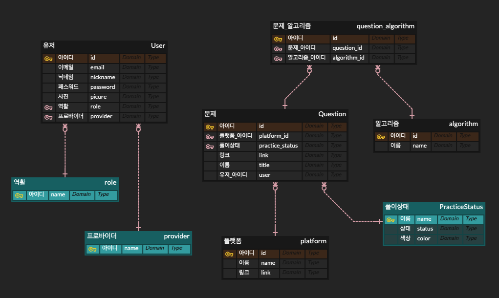

# ['리멤버'](https://rememberandpass.herokuapp.com) 기술 노트 (작성중...)

## 0. 기술스택
#### 백엔드
- SpringBoot 
  - Spring web (MVC + tomcat)
  - Spring security
  - Spring oauth2 client (소셜로그인)
  - Spring data jpa
  - Spring data rest
- lombok
- jdbc mariadb, flyway(DB 형상관리), querydsl

#### 프론트
- thymeleaf
- jquery
- bootstrap, bootstrap-select (폼 select)
- alertify (알람 라이브러리)


## 1. 스프링부트로 개발시작
리멤버 개발을 위해 기존에 공부했던 Django 프레임워크를 사용할까 잠깐 고민을 했습니다.
하지만 많은 기업에서 백엔드 프레임워크로 스프링을 사용하고 있음이 느껴져서, 스프링을 공부해보면 좋을것 같다는 판단이 섰습니다.

스프링부트는 기존 스프링에 톰캣서버를 내장하고 있고 의존성을 어느정도 자동으로 관리해주는 기능을 갖추고 있어서 
스프링에 입문하는데 큰도움이 되었습니다.

```shell
plugins {
  id 'org.springframework.boot' version '2.6.7'
  id 'io.spring.dependency-management' version '1.0.11.RELEASE'
  id 'java'
}

dependencies {
	implementation 'org.springframework.boot:spring-boot-starter-data-jpa'
	implementation 'org.springframework.boot:spring-boot-starter-data-rest'
	implementation 'org.springframework.boot:spring-boot-starter-security'
	implementation 'org.springframework.boot:spring-boot-starter-oauth2-client'
	implementation 'org.springframework.boot:spring-boot-starter-validation'
}
```
위와 같이 특정버전의 'org.springframework.boot' 플러그인과 'io.spring.dependency-management' 플러그인을
설치하면 스프링부트 버전의 spring-boot-dependencies bom을 받아온다. 그래서 스프링 생태계의 프레임워크나 같이 자주쓰이는 라이브러리들에 한해서는 
버전의 명시를 따로 해줄필요가 없어집니다.

스프링을 공부하면서 놀랐던것은 django의 경우 거의 모든 기능이 하나의 프레임워크에 포함되어있었지만, 
Spring은 서로 다른 프레임워크로 기능들이 쪼개져 있었습이다. 따라서 필요한 기능을 제공하는 스프링의 프레임워크들을 찾아서
gradle 의존성에 추가해주는 작업이 필요했습니다.

그래서 Spring web (MVC + tomcat), Spring 시큐리티(보안), Spring oauth2 client(소셜로그인), 
Spring data jpa(편리하게 리파지토리 생성), Spring data rest(restful한 response object 생성)등의
프레임워크들을 추가해주었고, 편리하게 생성자를 생성해주는 롬복, JPQL 쿼리를 도와주는 Querydsl을 의존성에 추가했습니다.

## 2. 역활을 명확히 나누어서 설계해보자
<계층분리 사진 삽입 위치><br>
스프링를 공부하기 위해 이동욱님이 저술한 '스프링부트와 AWS 혼자 구현하는 웹서비스' 라는 책을 읽게 되었습니다. 책을 읽다보니
객체의 책임을 Controller, Service, Repository, Domain, DTO 로 나누는모습을 볼수 있었고, 
저도 책에서 권장하는 설계를 해보기로 마음먹었습니다.

그래서 Controller는 요청 uri과 서비스연결 및 타임리프 랜더링을 위한 모델 셋팅, 
Service는 Domain들에 요청을 보낸후 결과 조합, Domain은 서비스에서 필요로하는 로직을 실행,
Repository는 데이터베이스 접근, DTO는 각계층에서 사용되는 객체들의 변환, 
Security는 사용자 인증 및 접근 제한으로 역활을 나누어 설계히려 노력했습니다.

## 3. 데이터베이스 스키마 설계
제가 세웠던 유저스토리의 첫번째는 '사용자는 자신이 풀었던 알고리즘 문제들에 대한 정보(링크, 문제이름등...)를 저장할수 있다' 입니다.
이 유저스토리를 만족하기 위해서는 문제, 알고리즘, 트래이닝 플랫폼, 풀이상태 등의 테이블이 필요했고, 
자신이 등록한 문제들을 관리할수 있어야 하기 때문에 회원정보를 가지고 있는 유저 테이블등이 필요했습니다.

저는 [ERDCloud](https://www.erdcloud.com/) 서비스를 이용하여 아래와 같이 스키마를 설계했습니다. 
검정색은 실제 데이터베이스 테이블, 청록색은 Enum으로 표시했습니다.



## 4. 풀이상태를 표현하기 위해 ENUM 사용
기존에는 풀이상태를 표현하기 위해서 데이터베이스 테이블을 생성하여 관리했습니다. 그리고 유저가 생성했던 문제와 함께 풀이상태를 같이 읽어올수 있도록 
fetch join 기법을 사용했었습니다. 아래와 같이 말이죠

```java
 @Override
public Optional<Question> findById(Long id) {
    QQuestion question = QQuestion.question;

    JPAQuery<Question> query = queryFactory
        .select(question)
        .from(question)
        .innerjoin(question.practiceStatus).fetchjoin()
        .where(question.id.eq(id));
    return Optional.ofNullable(query.fetchOne());
}
```

Querydsl을 사용해서 fetch 조인을 쉽게 사용하여 쿼리횟수를 줄일수 있었지만 좋은 설계로 보이지는 않았습니다. 왜냐하면 풀이상태에 저장될 컬럼은
'PERFECT', 'GREAT', 'GOOD', 'FAIL'의 총4개에 풀과하기 때문입니다. 그러던중 
우아한형제들에서 운영하는 기술블로그의 [Java Enum 활용기](https://techblog.woowahan.com/2527/) 읽게 되었습니다. 이 포스팅에선
제가 생각한 문제를 정확하게 지적하고 있었고 이를 ENUM을 통해 해결하는모습을 보여줘서 그대로 따라해보기로 했습니다.

```java
public enum PracticeStatus {
    /*
     * datas
     */
    PERFECT("PERFECT", "#00ff00"),
    GREAT("GREAT", "#aaff00"),
    GOOD("GOOD", "#ffdb4d"),
    FAIL("FAIL", "#ff3333");


    private static List<PracticeStatus> allList;

    private final String STATUS;
    private final String COLOR;

    /*
     * constructor
     */
    PracticeStatus(String STATUS, String COLOR) {
        this.STATUS = STATUS;
        this.COLOR = COLOR;
    }

    public String getStatus() {
        return STATUS;
    }

    public String getColor() {
        return COLOR;
    }

    public static List<PracticeStatus> findAll() {
        if (Objects.isNull(allList)) {
            allList = new ArrayList<>(
                    Arrays.asList(PERFECT, GREAT, GOOD, FAIL)
            );
        }
        return allList;
    }
}
```
기존의 @Entity 어노테이팅이 되었던 PracticeStatus 를 Enum으로 리펙토링 했습니다. 이제
쿼리를 날릴때 fetchjoin을 해줄 필요가 없어졌고, 새로운 속성이 추가될경우엔 ENUM값을 추가해주기만 하면 됩니다.

유저가 풀이상태를 업데이트하려면 어떤 상태들이 있는지 알아야 하기 때문에 모든 상태들을 불러올 경우가 많습니다. 그래서 싱글톤 패턴을 사용하여 
풀이상태 리스트를 한번 생성해놓고, 서비스에서 필요할때 불러쓰는 방식으로 최적화했습니다.

이와 마찬가지로 Platform(백준, 프로그래머스 ...) 역시 Enum으로 리펙토링할 계획을 가지고 있습니다.

## 5. 엔티티의 공통된 컬럼을 분리하여 추상클래스로 분리하기
중요하지는 않지만 테이블의 튜플들이 생성될때 생성날짜와 업데이트날짜를 집어넣고 싶었습니다. 기존에는 아래와 같이 클래스에 직접
createdDate, modifiedDate 필드를 직접 선언해주었습니다. 이때 @EntityListeners(AuditingEntityListener.class) 
어노테이션을 이용하면 자동으로 시간을 매핑하여 튜플에 넣어줍니다.

```java
@Entity
@EntityListeners(AuditingEntityListener.class)
public class Platform {
  @Id
  @GeneratedValue(strategy = GenerationType.IDENTITY)
  private Long id;

  @Column(length = 100, nullable = false)
  private String name;

  @Column(length = 255, nullable = false)
  private String link;

  @CreatedDate
  private LocalDateTime createdDate;

  @LastModifiedDate
  private LocalDateTime modifiedDate;
}
```

하지만 이코드들을 모든 entity에 일일히 집어넣어주는것은 귀찮은일입니다. 그래서 audit 기능을 가지고 있는 추상클래스를 만들고, 이를
다른 entity 클래스에서 상속해서 사용하도록 구현했습니다. @MappedSuperclass 어노테이션은 
상속한 필드들을 컬럼으로 인식시키는 기능을 합니다. 또한 @Entity 어노테이션의 기능도 같이 제공하는것으로 보여집니다.

```java
@MappedSuperclass
@EntityListeners(AuditingEntityListener.class)
public abstract class BaseTimeDomain {
    @CreatedDate
    private LocalDateTime createdDate;

    @LastModifiedDate
    private LocalDateTime modifiedDate;
}

// 이렇게 바꿔줍시다
@Getter
@NoArgsConstructor
public class Platform extends BaseTimeDomain {
  @Id
  @GeneratedValue(strategy = GenerationType.IDENTITY)
  private Long id;

  @Column(length = 100, nullable = false)
  private String name;

  @Column(length = 255, nullable = false)
  private String link;

```

